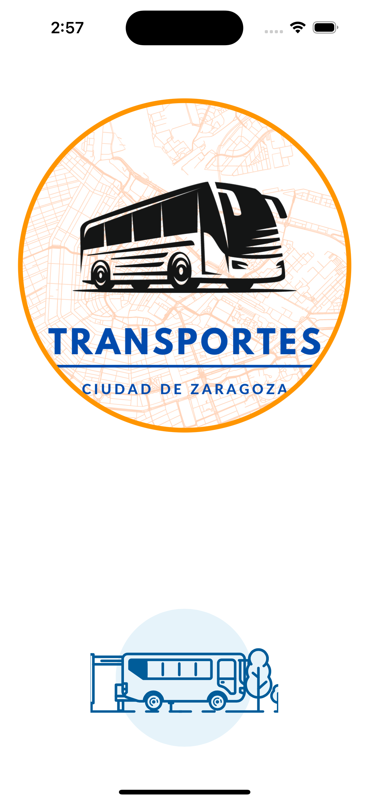
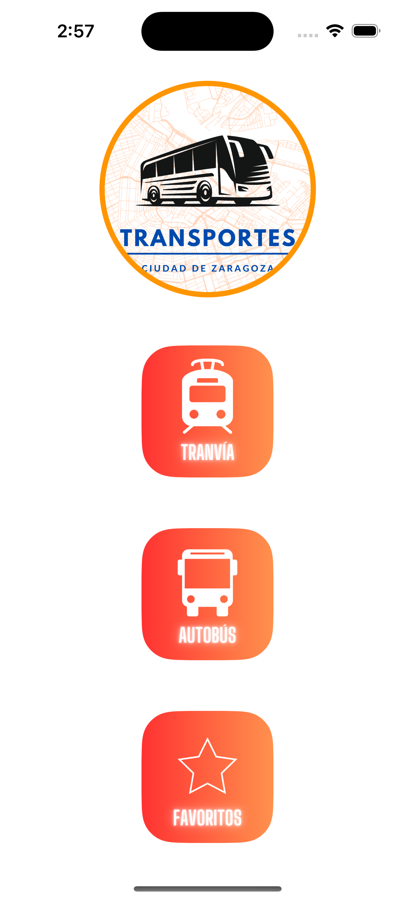
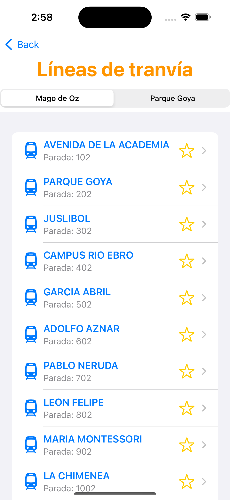
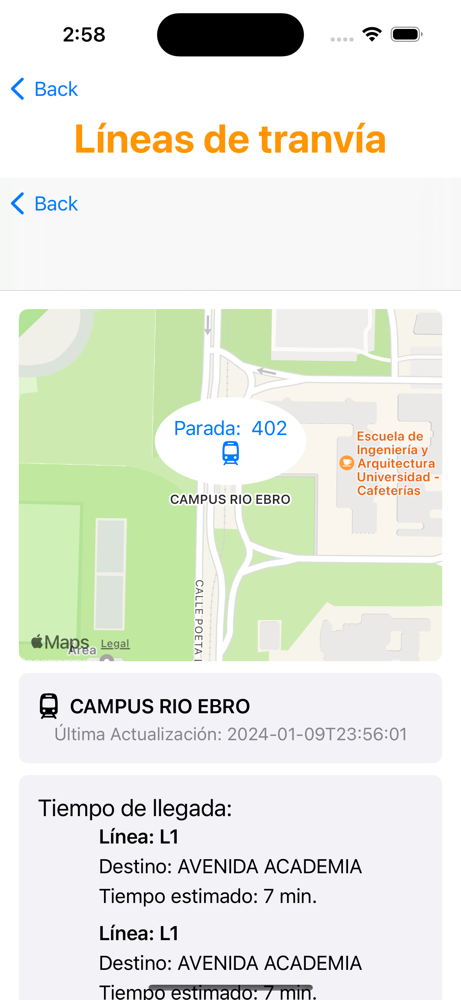
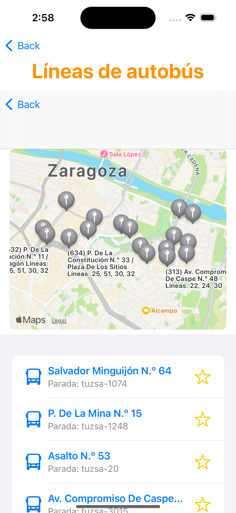
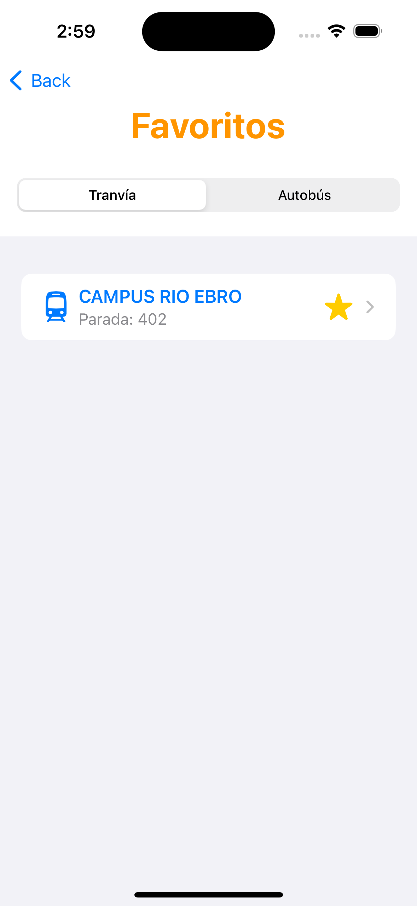

# Transportes Ciudad de Zaragoza

  

La aplicación definitiva para acceder a información sobre el transporte público en la ciudad de Zaragoza desde tu dispositivo iOS.

## Descripción General

**Transportes Ciudad de Zaragoza** es una aplicación desarrollada en **Swift**, el potente lenguaje de programación de Apple, y diseñada con **SwiftUI**, el framework de UI de última generación de Cupertino. Esta combinación garantiza no solo una experiencia de usuario fluida y atractiva, sino también un desarrollo eficiente y de alta calidad. El uso de SwiftUI, en particular, permite una construcción de interfaces de usuario más que aprovecha al máximo las capacidades de Swift.

El proyecto sigue una **Arquitectura Clean, principios SOLID y un patrón MVVM** para la interfaz de usuario, lo que garantiza una separación clara entre la presentación y la lógica de negocio.

Este proyecto utiliza la [API del Ayuntamiento de Zaragoza](https://www.zaragoza.es/sede/servicio/urbanismo-infraestructuras/transporte-urbano), un servicio que pone a su disposición los diferentes conjuntos de datos que publica el Ayuntamiento de Zaragoza. Ofrece diferentes formatos y operaciones para la consulta de los mismos.

## Features

- **Mapa Interactivo**: Visualiza las paradas de tranvía y las líneas de autobús en un mapa interactivo de Zaragoza. 
- **Tiempos de espera en tiempo real**: Consulta los tiempos de espera actualizados para cada parada de transporte público.
- **Guarda tus Favoritos**: Marca tus paradas y líneas de autobús favoritas para acceder rápidamente a ellas.

## Capturas de pantalla

  
  
  
  
  
  

## Estructura del Proyecto

La aplicación se adhiere a una **Arquitectura Clean** y sigue los **principios SOLID**, organizada en las siguientes carpetas de alto nivel dentro del directorio raíz del proyecto:

- `Assets.xcassets/`: Contiene todos los recursos visuales y de diseño, como imágenes, iconos o paletas de colores.
- `Data/`: Capa de datos que gestiona la comunicación con la API del Ayuntamiento de Zaragoza y el almacenamiento local.
  - `Repositories/`: Puntos de acceso unificados para los datos, proporcionando una interfaz limpia hacia los servicios de datos.
    - `BusStopsRepository.swift`: Encargado de las operaciones relacionadas con las paradas de autobús.
    - `TramStopsRepository.swift`: Maneja las operaciones relacionadas con las paradas de tranvía.
  - `Services/`: Implementación detallada de la lógica de negocio y acceso a los datos.
    - `Local/`: Servicios que gestionan el almacenamiento local de datos usando `UserDefaults`.
      - `BusStopsLocalService.swift`
      - `TramStopsLocalService.swift`
    - `Remote/`: Servicios que manejan la comunicación con la API externa.
      - `LiveBusStopsRemoteService.swift`
      - `LiveTramStopsRemoteService.swift`
- `Entities/`: Define las estructuras y modelos de datos centrales utilizados en toda la aplicación.
- `Extensions/`: Extensiones de Swift que proporcionan funcionalidades adicionales o simplifican ciertas operaciones en todo el proyecto.
- `Features/`: Contiene todas las características de usuario, cada una siguiendo el patrón MVVM.
  - `BusLines/`: Funcionalidades relacionadas con la visualización y gestión de las líneas de autobús.
  - `TramStops/`: Funcionalidades para mostrar y manejar las paradas de tranvía.
  - `FavoritesList/`: Gestión y visualización de las paradas y líneas favoritas del usuario.
- `NetworkClient/`: Gestiona todas las llamadas de red utilizando `URLSession` para comunicarse con la API del Ayuntamiento y otros servicios web.
- `ContentView.swift`: Vista raíz de la aplicación SwiftUI.
- `Coordinator.swift`: Maneja la navegación y la inyección de dependencias en toda la aplicación.
- `TransportZaragozaApp.swift`: Define el comportamiento de la aplicación al iniciar y manejar el ciclo de vida.

## Librerías

Para el diseño de la aplicación, se han utilizado las siguientes librerías en el proyecto:

- **SwiftUI**: Un framework utilizado para diseñar y desarrollar interfaces de usuario con un código simple y declarativo.
- **MapKit**: Utilizado para integrar mapas interactivos y funciones de localización geográfica que permiten a los usuarios visualizar las paradas y rutas de transporte.

## Requisitos

- iOS 14.0 o superior.
- Xcode 12.0 o superior.
- Swift 5.3 o superior.

## Instalación

Sigue estos pasos para clonar el proyecto y ejecutar la aplicación en tu entorno local:

1. Abre la **Terminal** en tu Mac.
2. Navega hasta el directorio donde deseas clonar el proyecto.
3. Ejecuta el siguiente comando:
   git clone https://github.com/pablo-ziura/transports-zaragoza.git
4. Abre el proyecto en Xcode.
5. Selecciona un simulador o dispositivo conectado.
6. Ejecuta la aplicación con Cmd + R.

## Licencia

Este proyecto está licenciado bajo la Licencia MIT - ver el archivo [LICENSE.md](LICENSE.md) para detalles.